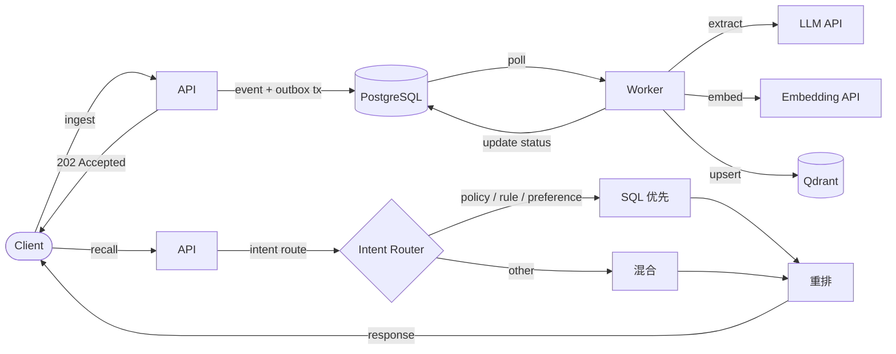

<p align="center">
  <h1 align="center">MemBurrow</h1>
  <p align="center">AI Agent 长期记忆服务。SQL 为真相层，向量为加速层。</p>
  <p align="center"><em>不是又一个纯向量 RAG。</em></p>
</p>

<p align="center">
  <a href="https://www.rust-lang.org/"></a>
  <a href="https://www.postgresql.org/"></a>
  <a href="https://qdrant.tech/"></a>
  <a href="https://www.docker.com/"></a>
  <a href="https://github.com/Mgrsc/MemBurrow/blob/main/LICENSE"></a>
</p>

<p align="center">
  <a href="README.md">English</a>
</p>

---

## 为什么不用纯向量？

没有长期记忆的 Agent 会反复索要上下文、遗忘用户偏好、违反已声明的规则——每轮对话都在烧 token 回放历史。

纯向量记忆让问题更糟：它按表面相似度检索，而不是按业务正确性检索。

| | 纯向量 | MemBurrow |
|---|---|---|
| 真相来源 | Embedding | ✅ SQL |
| 检索策略 | 仅 Cosine 相似度 | ✅ 意图路由 |
| 排序 | 单一相似度分数 | ✅ 多因子评分 |
| 规则 / 偏好 | 嵌入在文本块中 | ✅ 一等公民结构化类型 |
| 向量库宕机 | ❌ 无法召回 | ✅ SQL 降级 |
| 审计追踪 | ❌ 黑盒 | ✅ 完全可解释 |
| 写入语义 | Fire-and-forget | ✅ Outbox，精确一次 |

## 架构

**写入流程**

```
Client → API（event + outbox 事务，<60 ms，202）→ Worker → LLM 抽取 → Embed → Qdrant upsert
```

**召回流程**

```
Client → API → 意图路由 → SQL 优先 / 混合 → 重排 → Response
```



**评分公式：**

`score = semantic(0.45) + importance(0.18) + confidence(0.14) + freshness(0.13) + scope(0.10)`

## 核心特性

- **5 种记忆类型** — fact、preference、rule、context、event
- **意图路由** — policy/rule/preference 查询走 SQL 优先；其余走混合检索
- **Outbox 模式** — event + outbox 单事务写入，精确一次投递
- **优雅降级** — 向量库不可用时自动降级到 SQL 召回
- **作用域隔离** — tenant / entity / process 三级隔离
- **审计追踪** — 每条记忆操作完整可追溯
- **异步写入** — ingest 在 <60 ms 内返回；抽取在后台完成

> **Trade-off：** 异步写入意味着召回是最终一致性的——刚写入的记忆可能不会立即出现。

## 快速开始

```bash
git clone https://github.com/Mgrsc/MemBurrow.git && cd MemBurrow
cp .env.example .env  # 设置 OPENAI_API_KEY
docker compose up -d --build
```

验证：

```bash
curl -s http://localhost:8080/v1/memory/health
# {"status":"ok","timestamp":"..."}
```

## API 示例

**写入（Ingest）**

```bash
curl -s -X POST http://localhost:8080/v1/memory/ingest \
  -H 'Authorization: Bearer dev-token' \
  -H 'X-Tenant-ID: acme' \
  -H 'Content-Type: application/json' \
  -d '{
    "tenant_id": "acme",
    "entity_id": "user_123",
    "process_id": "planner",
    "session_id": "sess_001",
    "turn_id": "turn_001",
    "messages": [
      {"role": "user", "content": "I do not drink espresso."},
      {"role": "assistant", "content": "Noted."}
    ]
  }'
```

**召回（Recall）**

```bash
curl -s -X POST http://localhost:8080/v1/memory/recall \
  -H 'Authorization: Bearer dev-token' \
  -H 'X-Tenant-ID: acme' \
  -H 'Content-Type: application/json' \
  -d '{
    "tenant_id": "acme",
    "entity_id": "user_123",
    "process_id": "planner",
    "query": "Recommend a low-caffeine drink for this afternoon.",
    "intent": "recommendation",
    "top_k": 8
  }'
```

> 完整 API 文档：[LLM_README.md](LLM_README.md)

## 技术栈

| 层级 | 技术 |
|---|---|
| 语言 | Rust |
| HTTP 框架 | Axum |
| 数据库 | PostgreSQL + SQLx |
| 向量索引 | Qdrant |
| LLM / Embedding | OpenAI 兼容 API |
| 部署 | Docker Compose |

## 项目结构

```
MemBurrow/
├── api/
│   └── openapi.yaml
├── cmd/
│   ├── memory-api/          # HTTP API 服务
│   ├── memory-migrator/     # 数据库迁移
│   └── memory-worker/       # 异步抽取与 Embedding Worker
├── crates/
│   └── memory-core/         # 共享领域逻辑、模型、存储
├── migrations/              # SQL 迁移文件
├── docker-compose.yml
├── Dockerfile
└── .env.example
```

## 配置

<details>
<summary>环境变量</summary>

**必填**

| 变量 | 说明 |
|---|---|
| `DATABASE_URL` | PostgreSQL 连接字符串 |
| `API_AUTH_TOKEN` | API 认证 Bearer Token |
| `QDRANT_URL` | Qdrant gRPC/HTTP 端点 |
| `OPENAI_BASE_URL` | OpenAI 兼容 API 基础 URL（必须以 `/v1` 结尾） |
| `OPENAI_API_KEY` | LLM 和 Embedding 调用的 API Key |
| `OPENAI_EXTRACT_MODEL` | 记忆抽取模型（如 `gpt-4o-mini`） |
| `OPENAI_EMBEDDING_MODEL` | Embedding 模型（如 `text-embedding-3-small`） |
| `EMBEDDING_DIMS` | Embedding 维度（必须与模型输出一致） |

**可选**

| 变量 | 默认值 | 说明 |
|---|---|---|
| `API_BIND_ADDR` | `0.0.0.0:8080` | API 监听地址 |
| `WORKER_POLL_INTERVAL_MS` | `1500` | Worker 轮询间隔 |
| `WORKER_BATCH_SIZE` | `32` | Worker 批量大小 |
| `WORKER_MAX_RETRY` | `8` | 最大重试次数 |
| `RECALL_CANDIDATE_LIMIT` | `64` | 最大召回候选数 |
| `RECONCILE_ENABLED` | `true` | 启用对账 |
| `RECONCILE_INTERVAL_SECONDS` | `120` | 对账间隔 |
| `RECONCILE_BATCH_SIZE` | `200` | 对账批量大小 |
| `LOG_FORMAT` | `json` | 日志格式（`json` 或 `pretty`） |
| `RUST_LOG` | `info` | 日志级别 |

</details>

## 参考

- [Memorilabs — AI Agent Memory on Postgres: Back to SQL](https://memorilabs.ai/blog/ai-agent-memory-on-postgres-back-to-sql)
- [Qdrant 文档](https://qdrant.tech/documentation/)

## 许可证

[Apache-2.0](LICENSE)
