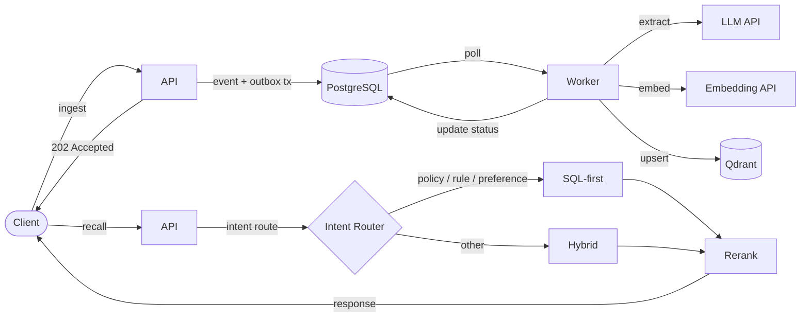

<p align="center">
  <h1 align="center">MemBurrow</h1>
  <p align="center">Long-term memory service for AI agents. SQL as the source of truth, vectors as the acceleration layer.</p>
  <p align="center"><em>Not another vector-only RAG.</em></p>
</p>

<p align="center">
  <a href="https://www.rust-lang.org/"></a>
  <a href="https://www.postgresql.org/"></a>
  <a href="https://qdrant.tech/"></a>
  <a href="https://www.docker.com/"></a>
  <a href="https://github.com/Mgrsc/MemBurrow/blob/main/LICENSE"></a>
</p>

<p align="center">
  <a href="README-zh.md">中文文档</a>
</p>

---

## Why Not Vector-Only?

Without long-term memory, agents repeatedly ask for context, forget user preferences, and violate previously stated rules — burning tokens replaying chat history every turn.

Vector-only memory makes this worse: it retrieves by surface similarity, not by operational correctness.

| | Vector-Only | MemBurrow |
|---|---|---|
| Source of truth | Embeddings | ✅ SQL |
| Retrieval strategy | Cosine similarity only | ✅ Intent-based routing |
| Ranking | Single similarity score | ✅ Multi-factor scoring |
| Rule / preference | Embedded in text chunks | ✅ First-class structured types |
| Vector DB down | ❌ No recall | ✅ SQL-only fallback |
| Audit trail | ❌ Opaque | ✅ Full explainability |
| Write semantics | Fire-and-forget | ✅ Outbox, exactly-once |

## Architecture

**Write Flow**

```
Client → API (event + outbox tx, <60 ms, 202) → Worker → LLM extract → Embed → Qdrant upsert
```

**Recall Flow**

```
Client → API → Intent Router → SQL-first / Hybrid → Rerank → Response
```



**Scoring formula:**

`score = semantic(0.40) + importance(0.16) + confidence(0.12) + freshness(0.22) + scope(0.10)`

`semantic = vector(0.70) + lexical(0.30)`

## Key Features

- **5 Memory Types** — fact, preference, rule, skill, event
- **Intent-Based Routing** — policy/rule/preference/constraint/safety/decision queries go SQL-first; others go hybrid
- **Outbox Pattern** — event + outbox written in a single transaction, exactly-once delivery
- **Graceful Degradation** — vector DB down? recall falls back to SQL-only
- **Scope Isolation** — tenant / entity / process isolation with internal namespace unification and SQL+Qdrant scoped filtering
- **Audit Trail** — full traceability for every memory operation
- **Async Write Path** — ingest returns in <60 ms; extraction happens in background

> **Trade-off:** async write path means recall is eventually consistent — a freshly ingested memory may not appear immediately.

## Quick Start

```bash
git clone https://github.com/Mgrsc/MemBurrow.git && cd MemBurrow
cp .env.lite.example .env  # lite profile by default, set OPENAI_API_KEY
docker compose up -d
```

Distributed profile:

```bash
cp .env.distributed.example .env
docker compose --profile distributed up -d
```

Verify:

```bash
curl -s http://localhost:8080/v1/memory/health
# {"status":"ok","timestamp":"..."}
```

## API Examples

**Ingest**

```bash
curl -s -X POST http://localhost:8080/v1/memory/ingest \
  -H 'Authorization: Bearer dev-token' \
  -H 'X-Tenant-ID: acme' \
  -H 'Content-Type: application/json' \
  -d '{
    "tenant_id": "acme",
    "entity_id": "user_123",
    "process_id": "planner",
    "session_id": "sess_001",
    "turn_id": "turn_001",
    "messages": [
      {"role": "user", "content": "I do not drink espresso."},
      {"role": "assistant", "content": "Noted."}
    ]
  }'
```

**Recall**

```bash
curl -s -X POST http://localhost:8080/v1/memory/recall \
  -H 'Authorization: Bearer dev-token' \
  -H 'X-Tenant-ID: acme' \
  -H 'Content-Type: application/json' \
  -d '{
    "tenant_id": "acme",
    "entity_id": "user_123",
    "process_id": "planner",
    "query": "Recommend a low-caffeine drink for this afternoon.",
    "intent": "recommendation",
    "top_k": 8
  }'
```

> Full API documentation: [LLM_README.md](LLM_README.md)

## Tech Stack

| Layer | Technology |
|---|---|
| Language | Rust |
| HTTP framework | Axum |
| Database | SQLite (lite) / PostgreSQL (distributed) + SQLx |
| Vector index | sqlite-vector (lite) / Qdrant (distributed) |
| LLM / Embedding | OpenAI-compatible API |
| Deployment | Docker Compose |

## Project Structure

```
MemBurrow/
├── api/
│   └── openapi.yaml
├── cmd/
│   ├── memory-api/          # HTTP API server
│   ├── memory-migrator/     # Database migration runner
│   └── memory-worker/       # Async extraction & embedding worker
├── crates/
│   └── memory-core/         # Shared domain logic, models, store
├── migrations/              # SQL migration files
├── migrations_sqlite/       # SQLite migration files
├── docker-compose.yml
├── Dockerfile
├── .env.lite.example
└── .env.distributed.example
```

## Configuration

<details>
<summary>Environment Variables</summary>

**Required**

| Variable | Description |
|---|---|
| `BACKEND_PROFILE` | `lite` or `distributed` |
| `API_AUTH_TOKEN` | Bearer token for API authentication |
| `OPENAI_API_KEY` | API key for LLM and embedding calls |
| `OPENAI_BASE_URL` | OpenAI-compatible API base URL (must end with `/v1` if set) |

**Optional**

| Variable | Default | Description |
|---|---|---|
| `SQLITE_DATABASE_URL` | `sqlite://./data/memburrow.db` | SQLite database URL (lite profile) |
| `SQLITE_VECTOR_EXTENSION_PATH` | `/usr/local/lib/sqlite-vector/vector.so` | sqlite-vector extension path (lite profile) |
| `SQLITE_BUSY_TIMEOUT_MS` | `5000` | SQLite busy timeout in milliseconds |
| `DATABASE_URL` | `` | PostgreSQL connection string (distributed profile) |
| `QDRANT_URL` | `http://qdrant:6333` | Qdrant gRPC/HTTP endpoint (distributed profile) |
| `API_BIND_ADDR` | `0.0.0.0:8080` | API listen address |
| `OPENAI_EXTRACT_MODEL` | `gpt-4o-mini` | Model for memory extraction |
| `OPENAI_EMBEDDING_MODEL` | `text-embedding-3-small` | Model for embeddings |
| `EMBEDDING_DIMS` | `1536` | Embedding dimensions (must match model output) |
| `WORKER_POLL_INTERVAL_MS` | `1500` | Worker poll interval |
| `WORKER_BATCH_SIZE` | `32` | Worker batch size |
| `WORKER_MAX_RETRY` | `8` | Max retry attempts |
| `RECALL_CANDIDATE_LIMIT` | `64` | Max recall candidates |
| `RECONCILE_ENABLED` | `true` | Enable reconciliation |
| `RECONCILE_INTERVAL_SECONDS` | `120` | Reconciliation interval |
| `RECONCILE_BATCH_SIZE` | `200` | Reconciliation batch size |
| `LOG_FORMAT` | `json` | Log format (`json` or `pretty`) |
| `RUST_LOG` | `info` | Log level |

</details>

## References

- [Memorilabs — AI Agent Memory on Postgres: Back to SQL](https://memorilabs.ai/blog/ai-agent-memory-on-postgres-back-to-sql)
- [Qdrant Documentation](https://qdrant.tech/documentation/)

## License

[Apache-2.0](LICENSE)
